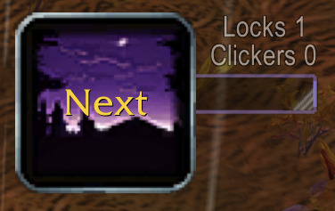
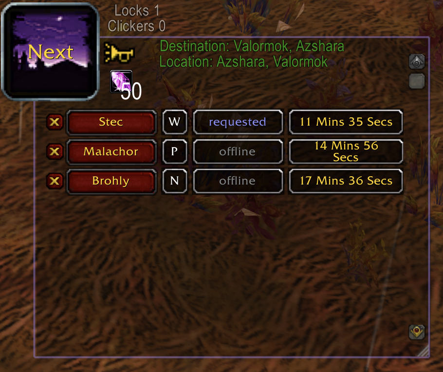
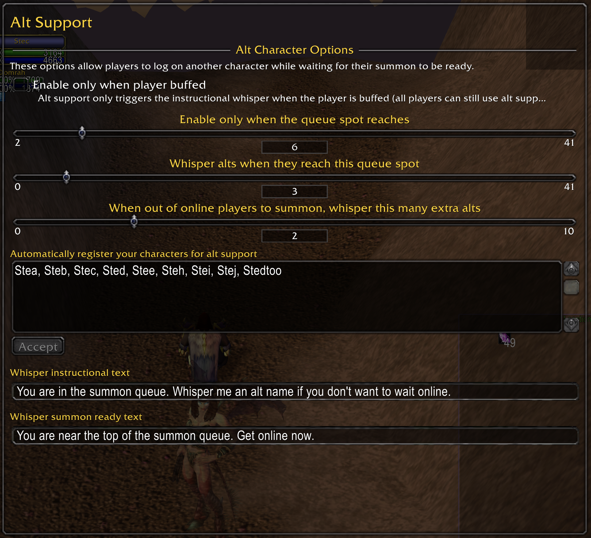
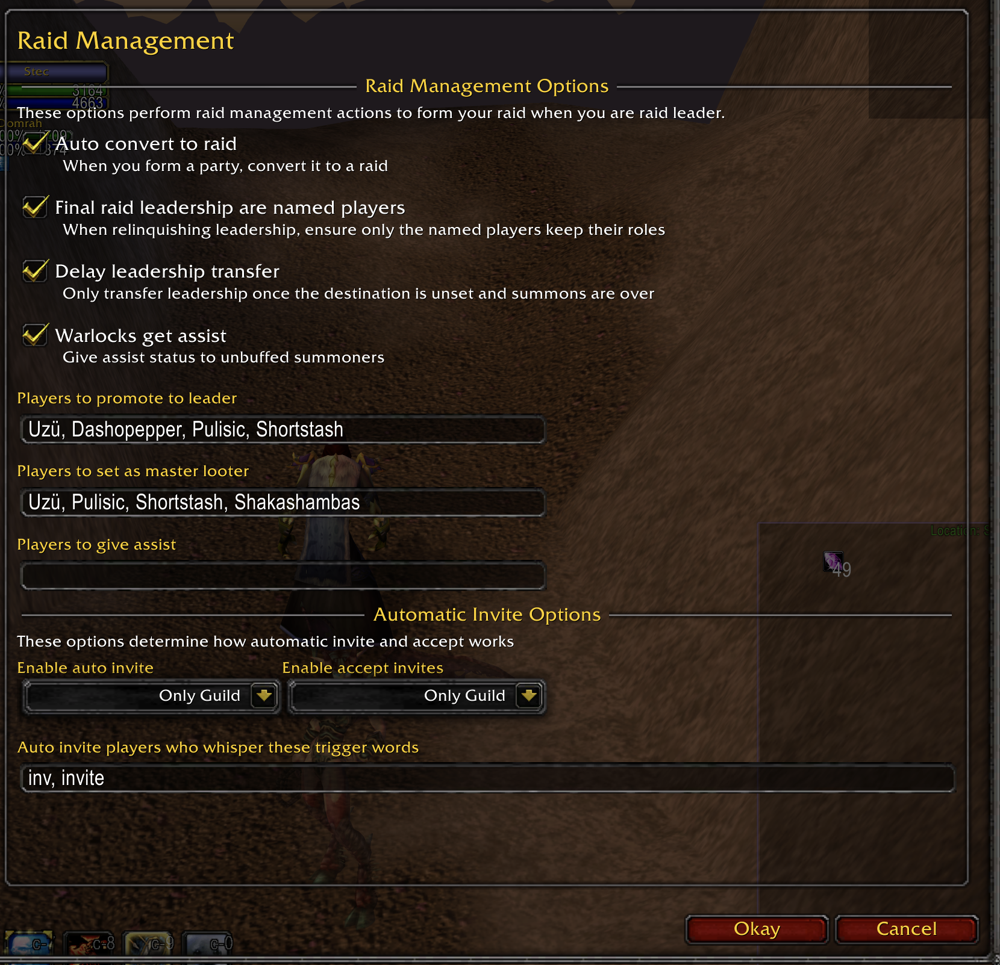
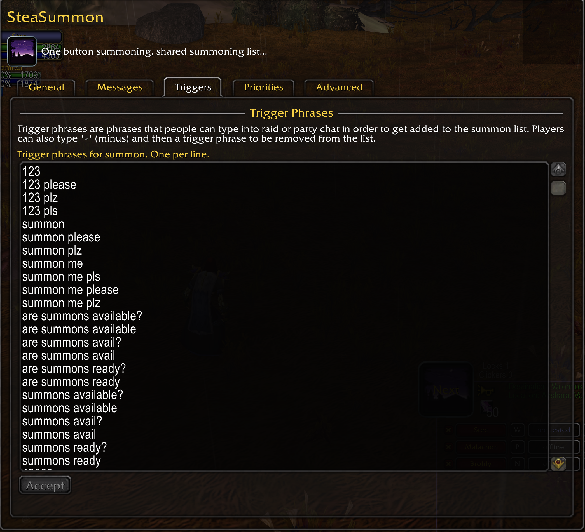

# SteaSummon

***FAN UPDATE***

WoW Classic addon for warlock raid summoning

## New

Manage your raid while summoning, relinquish raid lead when done summoning and leave the raid with raid roles in preferred state

Alt management: allows raiders to be on an alt so their buffs are not ticking, whispers when they are near the top of the list

Auto life tap: the Next button becomes a life tap button when out of mana for summon

## One button summoning, shared summoning list...

Click one button to summon the next raider on the priority based list. **That** button. No other buttons.
Just keep clicking **that** button. Nothing to read, nothing else to do. If you want to summon further down the list,
you can do that too. If you don't like to click, make a key bind. List all done? The button goes away, or the whole
window depending on your config. Not a Warlock? Make your warlocks get **that button** too, and you can start the summon list before they ever log on.

Features a minimal interface that gets out of your way while providing simple, easy, summoning for your whole raid.
Warlocks who have the addon share the same summon list with status updates to drive the one button summoning. Raiders
also have the benefit of seeing their place on the summon list while helping to keep the list alive.

Constant status updates distributed to the raid keeps the list current and informative. Know at a glance which raiders
have requested summons, which have a summon on its way, which have a successful summon awaiting acceptance, who's dead,
who's offline, who has world buffs... Strong, durable network code ensures that all raiders have the current list, the
*same* list, in the *same* order, with the *same* people on it. Logged on half way through the raid summon? Your list
is the *raid* list, with all the status intact.

## Raider self management

When your raiders type a summon phrase e.g. 123, they get added to the global summoning list shared by everyone in
your raid using the addon. When they type -123, they remove themselves, and if they have the addon they can just click
the x next to their name. If they didn't accept a summon they can reset their status by typing the summon phrase again,
without losing their place in the list. Players are removed from the summon list when they actually show up at the
destination, even if on foot.

Your raid can't learn 123? That's fine, you get to configure a list of all the dumbest summon requests you can think of.
That is, if you can think of something not already on the default list. Don't worry, your raid will help with that.

## Alt Support

Your summon list is long and the buffs are ticking. SteaSummon will whisper your raid members who are a ways down the list and tell them to whisper back an alt name and log off. The alts get whispered when the player's main gets near the top of the summon list.

## Raid Management

Warlocks often end up starting the raid to get it moving to the raid location. You can configure SteaSummon to manage the raid until the raid lead turns up or summons are over (whichever is configured). When handing over lead you can have Steasummon set up the raid the way your raid leader likes it, with assists and ML already set.

## Configuration

Most things are configurable

* summon trigger phrases
* summon communications through raid, whisper, and say
* summon list priorities (warlock, world buffs, named players)
* window scaling
* summon list save time (for relogging as the last add-on user in raid)
* key binds (Main Menu / Key Bindings / AddOns), never take your eyes off the movie
* alt management
* raid management
* turn off summon list sync (but who would want to do that? Really, who? I want their names and addresses.)

## Resources

If you can help translate this addon into other languages, please go to: https://www.curseforge.com/wow/addons/steasummon/localization
Or if you prefer, create a localization file like the one in ./Locale and send me a pull request on
Github. I like those.

For issues, feature requests, and straight up bugs, please use GitHub: https://github.com/prowley/SteaSummon/issues

## More Pictures

